# KALI-WINDOWS HOME LAB PROJECT

---

## Project Overview
- The purpose of this project is to simulate real world scenarios  of  likely events on a small network  between an attacking unit and a defending unit.
- Tools Utilized include: VirtualBox, Windows 10 , Kali-Linux, Nmap, WIreshark, Ufw(Uncomplicated Firewall)
- The Focus is to observe packets, ports, protocols and firewall behavior in various circumstances of attempted compromise by an attacker.
- We will explore a situation where Linux will be used to attack and vice versa to have a total perspective of how the two operating systems respond under these circumstances

---

## Objective
- Set up a home lab with windows 10 and Kali linux connected via Virtualbox host-only adapter
- Initiate various type of scans from Nmap and observe firewall, ports and packets  behaviors
- Capture packets on wire shark and get a better understanding of how ports and packets behave during scans on the wire.
- Logically navigate what this means on different levels of the OSI model, deep dive into the functionality of protocols.

---
#LINUXSCENARIO
## Lab Environment

| Component               | Details                       |     |
| ----------------------- | ----------------------------- | --- |
| Host OS                 | Windows 11                    |     |
| Attack Machine          | Kali-Linux VM                 |     |
| Target Machine          | Windows 10 VM                 |     |
| Virtualization Platform | Virtualbox                    |     |
| Network Type            | Host-Only                     |     |
| IP Range                | 192.168.56.0/24               |     |
| Tools Used              | Nmap,WIreshark,Cmd,Powershell |     |

---

## Network Configuration

| Machine  | IP Address      |
| -------- | --------------- |
| Attacker | 192.16 8.56.101 |
| Target   | 192.168.56.102  |

**Initial Firewall / Service Status**
- Firewall: Enabled
- SSH / SMB: SMB(445)Open/filtered by Firewall.
- Adapter Type: Host-Only Adapter

---

## Methodology & Execution

### Step 1 – Host Discovery
**Purpose:**  
To simply establish that the Network i had set up was functional. I initiated this scan from Kali

**Command Used**
```bash
sudo nmap -sn  192.168.56.0/24
```

**Findings:**

Three hosts up as expected (192.168.56.100,101,102)

## Step 2 - Port scanning

**Purpose:** Initialized various port scans to check windows network, services running ,versions of services running, fingerprint OS, and then a comprehensive scan for everything. This is to help observe what happens during these scans in relation to functionality of ports, protocols and firewall behavior. 

```
#Scan Network
sudo nmap -sn 192.168.56.102

#Check services running
sudo nmap -sS 192.168.56.102

#Check Versions of sevices running
sudo nmap -sV 192.168.56.102

#The verbose version check, does the same thing as the above(-sV) with more info
sudo nmap -vV 192.168.56.102

#Fingerprint OS
sudo nmap -O 192.168.56.102

#Summary scan(Combines all the above)
sudo nmap -A 192.168.56.102

```


**Findings:**
- The initial scans yielded no information as windows firewall was still active and did not allow any form of response from ports hence all scans showed ports in ignored/filtered states. 
- This is a good result for system security as windows firewall gives attacker little to no information about the system. 
- Upon modification of  the firewall as we'll see below by allowing access to port 8080 and started a listening service(http) then ran these scans again and it gave the expected result of one port opened with http listening(ACK). 
- All scans responded to the modification except -O and -A (in extension) as they require at least one port opened, one closed(This is because to fingerprint the OS there's need to test it's behavior across different scenarios).
- So i dropped firewall protection totally as windows firewall doesn't also allow reponses(RST) from closed port, it just responds on it's behalf as ignored/filtered(as seen before). 
- With Firewall out the way i could fingerprint the OS, run a summary scan and get accurate results.
- Dropping the firewall exposed some normally opened ports for essential services of the system usually secured behind the fire wall i.e Service Message Block(SMB) (445), Remote Procedure Call(RPC) (135), NetBios(139). These are essential services for file sharing, authentication and remote access to servers/computers.


## Step 3 - Firewall Behavior and Effect On Ports and Scans.
**Purpose:**
It is impossible to put the scan results in context without understanding the behavior of the windows firewall; and as explained above it is impossible to get accurate results without simulating a firewall blip(unintentional disabling, cause who'll do that intentionally right?). Therefore in this section firewall rules were viewed and modified to suit the goal of the project after which it was restored to it's default state.

```
#Checking and modifying firewall rules to allow traffic to TCP(8080)
#Check firewall profiles set by default
Get-NetFirewallProfile | Select Name,Enabled

#Modify Firewall Rule To Allow Tcp to port 8080
New-NetFirewallRule -DisplayName "Allow TCp 8080" -Direction Inbound -Localport 8080 -Action Allow -Protocol Tcp

#Start a listening service bound to host to make best use of opened port(Not firewall related but it makes what we did work)
Python3 -m http 8080

#Confirm listening service's activity
Netstat -ano | findstr "*8080*"

#Disabling Firewall to allow direct access to port feedback for effective OS fingerprinting and summary scan

#Disable Firewall to allow closed port response(RST)
Set-NetFirewallProfile -Profile Domain,Private,Public -Enabled False

#Enable Firewall Back After Scan(When we're done with the scan)
Set-NetFireWallProfile -Profile Domain,Private,Public -Enabled True.
```

**Findings:**
Windows Firewalls drop packets before it reaches ports hence why initial scan doesn't get a response(great for security). Disabling the  firewall allowed accurate scans(In real life this would be a vulnerability that was exploited by an attacker).

## Step 4 Traffic analysis Via Wireshark
**Purpose:** 
To see what is actually happening real-time as we send probes through Nmap Scans. Great monitoring tool for SOC. Pictures below speak for themselves for before firewall was disabled and when it was disabled.
See Images below at evidence section for further reference.

---
#WINDOWSSCENARIO
## Lab Environment

| Category                | Details                          |
| ----------------------- | -------------------------------- |
| Host Machine            | Windows 11                       |
| Target Machine          | Kali-Linux VM                    |
| Attack Machine          | Windows 10 VM                    |
| Virtualization Platform | Virtualbox                       |
| Network Type            | Host-only Adapter                |
| IP Address Range        | 192.168.56.0/24                  |
| Tools Used              | Nmap, Wireshark, UFW, Powershell |

---
## Network & System Configuration

| Machine  | Ip Address     |
| -------- | -------------- |
| Attacker | 192.168.56.102 |
| Defender | 192.168.56.101 |


**Initial Firewall / Service Status**
- Firewall: Disabled
- SSH / SMB: SSH closed/No Firewall protection.
- Adapter Type: Host-Only Adapter

---

## Methodology & Execution

### Step 1 – Host Discovery
**Purpose:**  
To check functionality of the network. Run below on Cmd 

**Command(s) Used**
```bash
nmap -sn  192.168.56.0/24
```

**Findings:**

Three hosts up as expected (192.168.56.100,101,102)

## Step 2 - Port Scanning

**Purpose:** As previously discussed, just the reverse windows scenario 

```
#Scan Network
nmap -sn 192.168.56.101

#Check services running
nmap -sS 192.168.56.101

#Check Versions of services running
nmap -sV 192.168.56.101

#The verbose version check, does the same thing as the above(-sV) ut gives more info
nmap -vV 192.168.56.101

#Fingerprint OS
nmap -O 192.168.56.101

#Summary scan(Combines all the above)
nmap -A 192.168.56.101

```


**Findings:**
- The initial scans yielded all the information needed, why? Kali isn't made as an enterprise system but as an attack tool, therefore it comes without a preconfigured firewall. It's prioritized for easy access for remote control of servers and by default is fair game in an attackers world if not hardened by user.
- TCP ports 8000 and 8089 were found open, this is due to some splunk services listening on them; I had splunk installed for my last project and configured it to start in the background whenever i boot. 
- The sV scan rightly shows Splunkd(Splunk daemon) as user of the listening service.
- Then upon turning on ufw firewall on kali the ports went silent just as it happened when the firewall was up on windows.
- All these can be seen also on the wire via wireshark.


## Step 3 - Firewall Behavior and Effect On Ports and Scans.
**Purpose:**
AS explained before see below codes executed on kali to enable and disable firewall.
```
#Check firewall status
sudo ufw status

#Enable firewall
sudo ufw enable

#Ufw firewall automatically allows tcp access

#Disable Firewall
sudo ufw disable
```

**Findings:**
The ufw firewall unlike the windows firewall allows direct response from ports hence even when the firewall is enabled the port still gives information that it is closed meaning it sends RST packets unlike the windows firewall that drops the packets and never lets them reach the ports.

## Step 4 Traffic analysis Via Wireshark
**Purpose:** 
To see what is actually happening real-time as we send probes through Nmap Scans. Great monitoring tool for SOC. Pictures below speak for themselves for before firewall was disabled and when it was disabled.
See Images below at the evidence section for various comparisons between scans of when the firewall was down and when it was enabled.

----
## Security Implications

- Windows has a solid default baseline security-wise, probably because it is viewed as an enterprise device and although kali uses a minimalist approach in service exposure(you even have to allow ssh in ufw). We cannot clearly say one system trumps the other security wise the most secure system ultimately depends on how much the user hardens them.
- Misconfigured firewall rules or profiles can create loop hole for attackers to obtain access to ports
- Information gained by port scans and os fingerprinting can aid attackers immensely hence why the blue team must always be on guard.
- Network segmentation can never be overemphasized as we can see here, defense in depth will never go out of trend.
---

## Lessons Learned

- Nmap scan results must be interpreted in context
- Firewall configuration significantly alters scan outcomes
- Wireshark is a great tool and actually can help give context to Nmap scans.
- Nmap and Wireshark can give information of great value to help the Blue team retrace and map the present security position of a system but it can also be of great use to the attacker therefore it's really a double edged sword if you think about it.
- I was able to learn about the activities that occur on different levels of the OSI model especially from Layer 1 to 4 (Physical layer, Datalink layer, Network and Transport layer.)
- We really don't have a physical layer(maybe my laptop?) cause we're connected to a virtual switch(Virtual NIC) in the sense of the virtualbox.
- The Datalink layer where we resolve packet destination via ARP.
- Network layer making use of ICMP(for pings) and our switch directing packets to our various IPs. 
- The interaction between packets, ports and protocols happen on layer 4. 

---

## Future Improvements
- To actually conduct a deep vulnerability scan.
- Set up OpenVAS or Nessus.
- Scan Both OS and create a report.
- Create a remediation plan for identified vulnerabilities.
- Why?: The above activities check the baseline status of the system on a network, it's ports and also shows the importance of a firewall in these interactions. Nmap discovers network level vulnerablities. Wireshark corroborates Nmap and shows everything on the wire. OpenVAS does a deep dive and actually gives service and patch level analysis

---

## Final Summary

This lab demonstrated how OS defaults and firewall settings influence network visibility. It highlighted the importance of interpreting Nmap scans correctly and the defensive value of limiting exposed services in both Windows and Linux systems.

---
## Evidence / Screenshots

**Linux Scenario**

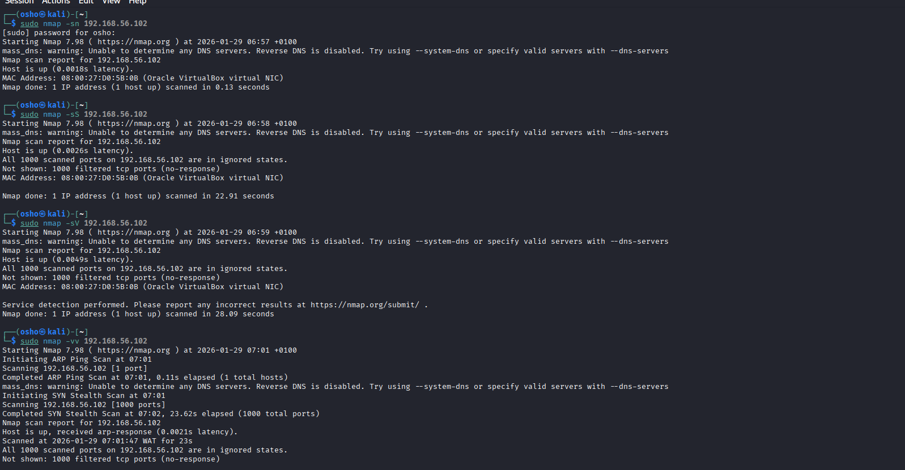
*Figure 1 - Nmap scan results before firewall was disabled note that all ports are in ignored state

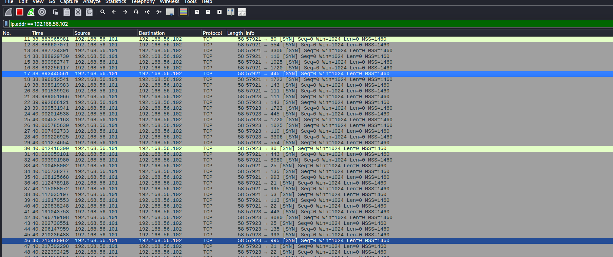
*Figure 2 - Wireshark scan showing no reponse from ports(Only SYN Requests)

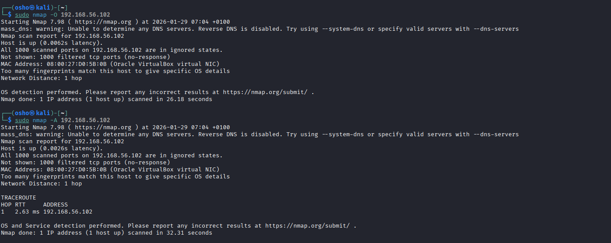
*Figure 3 - Nmap -O scan showing inability to finger print OS due to ports in ignored state too

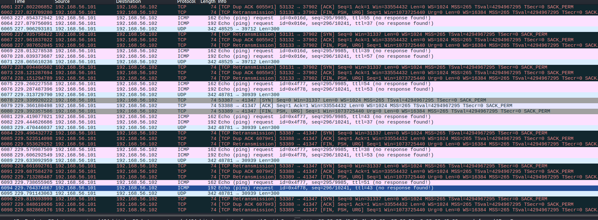
*Figure 4 - Wireshark showing no response from to OS fingerprint attempt(Notice varying requests as explained)

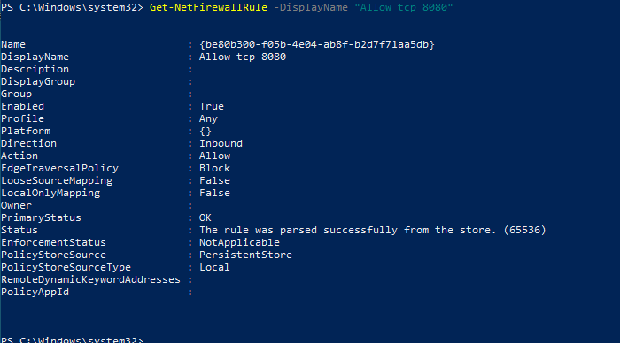
*Figure 5 - Checking Firewall Rule created

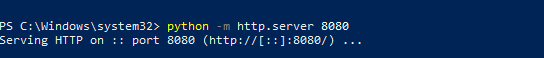
*Figure 6 - Starting a listening service  on port 8080


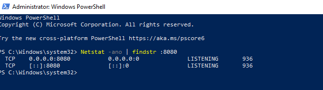
*Figure 7 - Checking  the listening service i.e Netstat -ano | findstr 8080

Note: Pictures for enabling and disabling firewall was not added as they really do not differ from the codes shown in firewall section of the write up above.

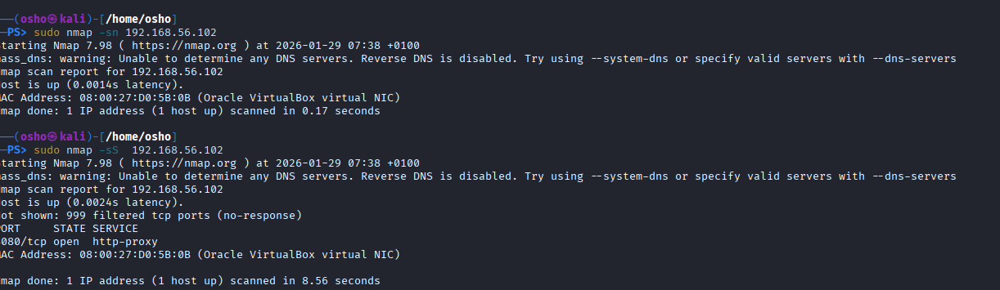
*Figure 8 - Retrying the Nmap scans again see difference as there is now response as Firewall was disabled

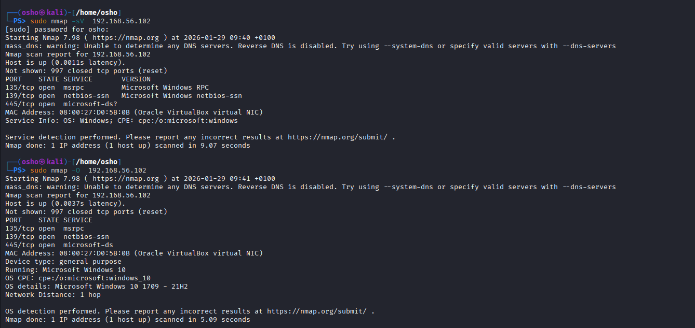
*Figure 9 - Same process as previous scans  see successful fingerprint and port responses to nmap scan.(Note this was done after fully disabling of the firewall).

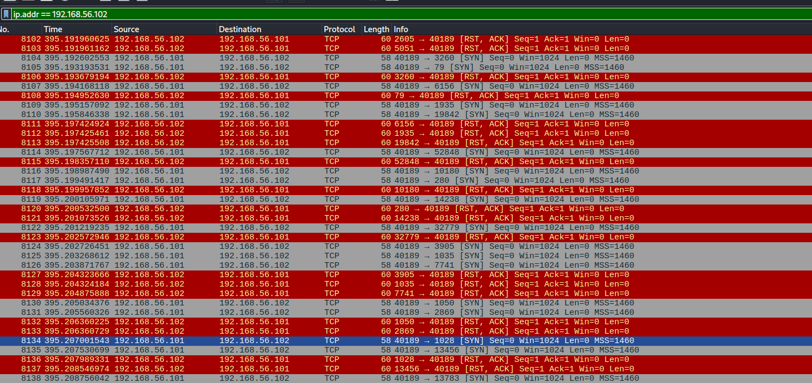
*Figure 10 - Wireshark showing TCP ACK, RST responses to scans now that firewall is down

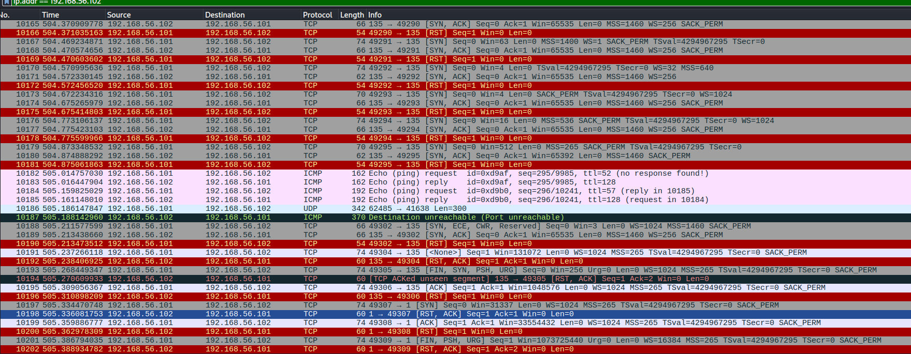
*Figure 11 - Wireshark showing response to various probes for O scan


**Windows Scenario**

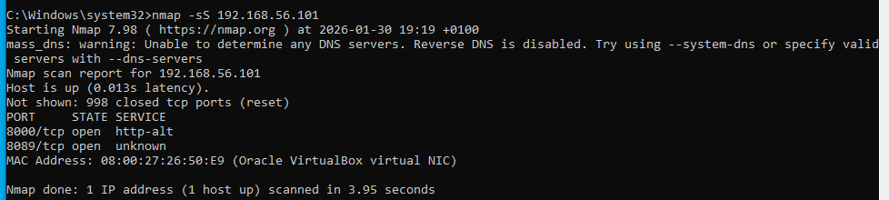
*Figure 12 - Initial -sS scan result showing two ports open as a result of port response as there's no firewal blocking

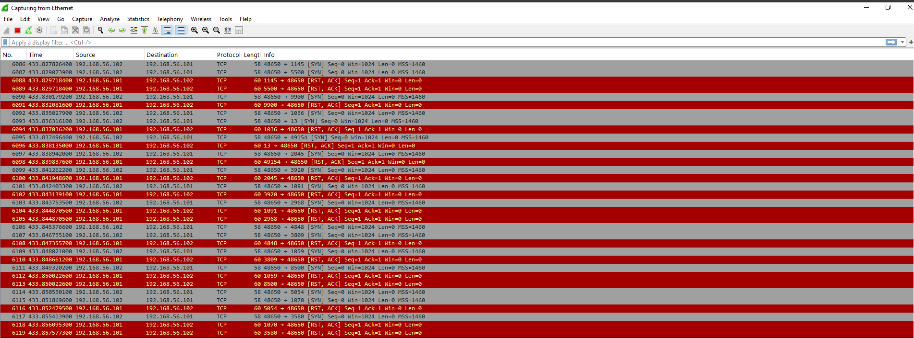
*Figure 13 - Wireshark scan showing TCP RST,ACK response showing port activity

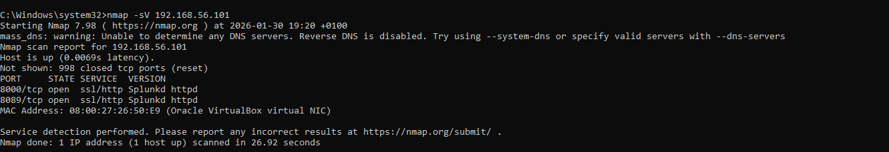
*Figure 14 - Nmap sV scan showing the listening service as splunk Daemon as explained earlier

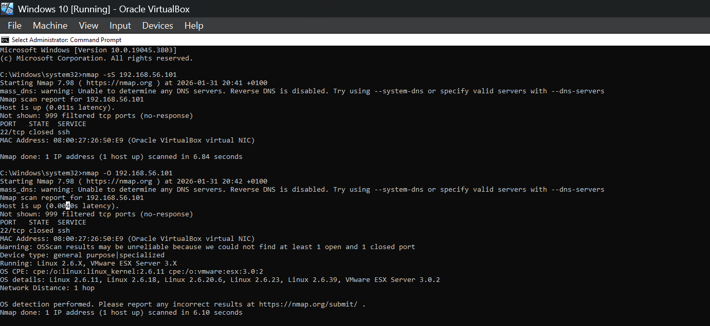
*Figure 15 - nmap O and sS scan results  with firewall up, notice port 22 response unlike windows.

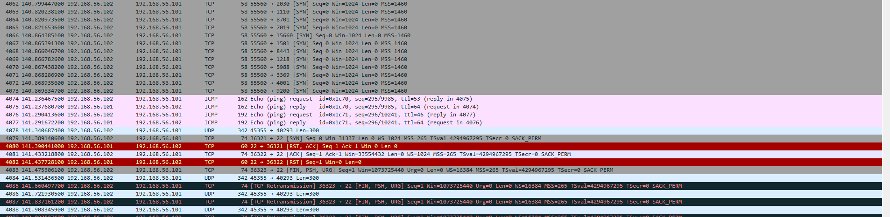
*Figure 16 - Wireshark traffic analysis  showing -O scan with RST tcp response for show closed port and others unresponsive


That's all, thank you for staying till the end.

Thank you.